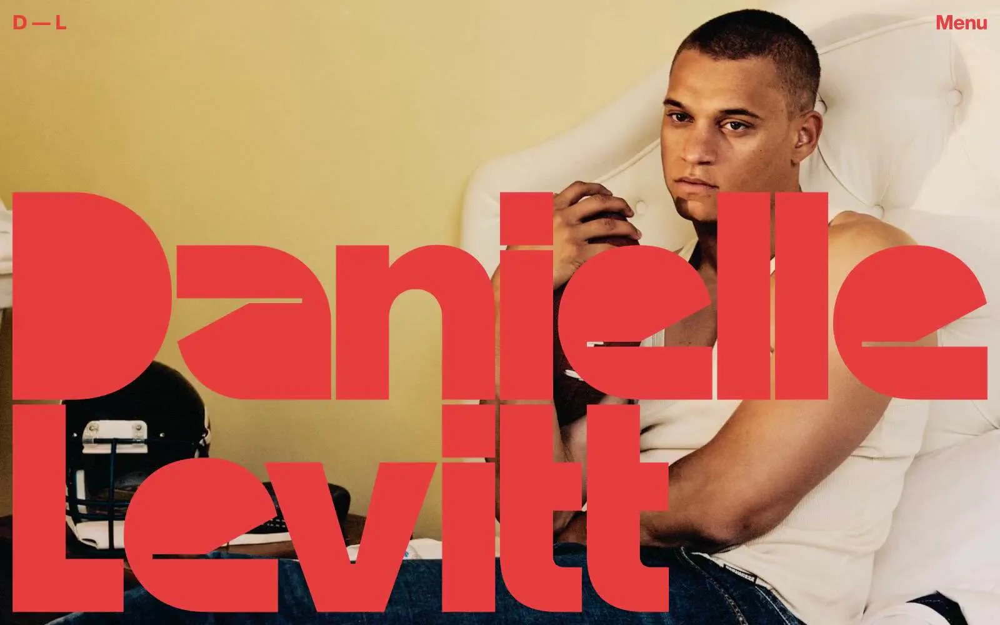
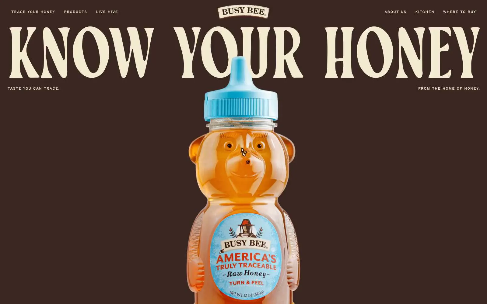

# DESIGN-CONTRACT: golden-wings-robyn.com Nuxt rebuild (Prompt 3)

Status: contract for Caleb to answer. Nothing here is built, mocked up, or deployed. Every rule cites its source. Where no source decides a point, it is an OPEN QUESTION with options and no pick.

Repo state checked before writing: `E:\~GoldenWings\presskit\robyn-nuxt`, HEAD `52c80d7` ("Add Meta Pixel (26876203855319594) to all pages"), clean tree.

## How to read this

- **Rule**: already decided. Each rule names its source.
- **Current state**: what the code does today. A fact, not a rule.
- **OPEN**: not decided by any source. Options are listed in no order of preference. Caleb picks.
- Copy: Caleb writes all copy. Existing lines are quoted unchanged with file:line. Anything new is `[CALEB WRITES]`.

Source abbreviations:

| Tag | Source |
|---|---|
| BRIEF | `BRIEF.md` (repo root), line numbers |
| DS | `E:\~GoldenWings\presskit\GoldenWings-Design-System\`, file:line |
| FIG | Figma library `BOoH4ZL2kzpz3bXbCXhYaT` (https://www.figma.com/design/BOoH4ZL2kzpz3bXbCXhYaT), node or page, as logged in `figma-library/REPORT.md` and `state.json` |
| G# | a gap from `figma-library/gaps.md` (reopened only where a section depends on it) |
| REPO | `robyn-nuxt` at `52c80d7`, file:line |
| D# | a Caleb decision (below) |

Caleb decisions to date:

- **D1 Wordmark**: `E:\~GoldenWings\presskit\Images\Posters\GOLDEN WINGS POSTER TITLE PNG.png`, the stacked two-line version (1753 x 1121, SHA-1 `134C987C7C9616942ADAC43CC4D8D74E3DC2C566`), used unchanged. No vector exists. It holds only the words "Golden Wings" (FIG Wordmark 2:498, screenshot `04-brand-wordmark.png`).
- **D2 Fonts**: Airstream Regular for script; Monument Extended Ultrabold; Akira Expanded Super Bold; and Helvetica Bold 16 for body text. Special Elite stays, as the Design System defines it. (FIG local text styles, REPORT.md:51-57. Files present in `E:\~GoldenWings\presskit\Fonts`: `AIRSTREA.TTF`, `MonumentExtended-Ultrabold.otf`, `Akira Expanded Super Bold.otf`, `Helvetica-Bold.ttf`, and `SpecialElite-Regular.ttf`.)
- **D3 Every page**: the footer carries the California LGBTQ Chamber badge (REPO commit `2964d4f`, `app/components/SiteFooter.vue:17`), and the Meta Pixel loads (REPO commit `52c80d7`).
- **D4 Home rejected**: the earlier preview was "cheap", a "parking garage" home of 8 disconnected stacked sections. The contract must set a maximum section count and say how sections connect as one story.
- **D5 Headshots**: only from `E:\~GoldenWings\presskit\Images\Headshots`.

---

## 1. Page rhythm

### Rules

| # | Rule | Source |
|---|---|---|
| R-a | Story first, then ONE gwingz.com invitation at the END of a page. The site is a funnel and film info lobby, never a screening site. | BRIEF:8-9 |
| R-b | No Watch button or CTA in the header or nav. | BRIEF:9, BRIEF:28; FIG Header 4:142 ("no Watch; no CTA button", REPORT.md:46) |
| R-c | The home page must have fewer sections than the rejected 8, and its sections must read as one story. The exact ceiling is OPEN (R1). | D4 |
| R-d | Section grounds are full-bleed bands drawn from cream, sunset gold, deep teal, navy, and ink. Coloured bands carry the `.gw-grain` noise overlay at 14% multiply. | DS `readme.md:42`; DS `tokens/base.css:4-5` |
| R-e | One motif per composition (sunburst stripes, sparkle stars, or speed lines), used sparingly. | DS `readme.md:42`; DS `guidelines/brand-motif.html:1` |
| R-f | Layout: 1140px container, 32px gutters, 80px section padding, and a text measure of at most 60ch. | DS `readme.md:47`; DS `tokens/spacing.css:3` |
| R-g | Each section heading uses the SectionTitle pattern: Special Elite eyebrow, Monument Extended uppercase title, and optional Helvetica subtitle. | DS `components/core/SectionTitle.jsx:3-8`; DS `components/core/Eyebrow.jsx:2-4` |
| R-h | Motion: `cubic-bezier(.22,1,.36,1)`, 180 to 300ms. No bounces. No fades on load. | DS `readme.md:44`; DS `tokens/spacing.css:14-16` |
| R-i | No transparency and no blur. Everything is opaque print. | DS `readme.md:48` |
| R-j | Direction: 1970s airline advertising, restored rather than distressed. Warm, saturated, and printed. | DS `readme.md:32` |

### Current state (facts)

- REPO `app/pages/index.vue` renders **7** sections at HEAD: hero (line 9), Archive 1968 (35), Graduation 1971 (52), crew call with form (65), official poster (76), the story with Screenings card (93), and About the footage (110).
- The rejected preview had **8**: the same 7 plus the first-cut watch band as section 2 (`preview-shots/home-full-390.json`, `home-full-1440.json`). That band was removed in Prompt 0.5 (BRIEF:72).
- The rejected preview measured 5,661px tall at 390 wide and 6,007px at 1440 (same JSON files).
- Besides the hero link, the home page today has four more buttons: `index.vue:83` (primary, Download poster), `:84` (ghost, Press kit), `:102` (primary, The film), and `:103` (ghost, Indie Doc Journey).
- For comparison only (not a decision): the Design System's own UI kit home renders 4 blocks before the footer: Hero, Announcement, QuoteBand, and Bridge (DS `ui_kits/presskit/index.html:22`).

### OPEN

- **R1. Maximum number of home sections** (counting the hero, not counting the CTA band or footer). Options: (a) 3; (b) 4, which matches the DS UI kit home (`index.html:22`); (c) 5; (d) 6.
- **R2. What happens to each current block** once R1 is set. For each of the 7 blocks above, Caleb marks one of: (a) keep as its own section; (b) merge into a neighbouring section; (c) move to another page (for example, the poster to /press-kit, the crew form to /contact); (d) cut from home.
- **R3. Continuity device** that makes the sections read as one story (one or more). Options: (a) the hero timeline carried down the page as chapter markers: 1968 "Jay Ricks engineers the 747 training program.", 1971 "His daughter Robyn joins the first crew.", 2026 "Robyn is still flying. Now with Golden Wings, after 50+ years of service." (REPO `content/site/home.md:13-18`); (b) the 747 as the bridge between the chapters (DS `readme.md:5`; DS `ui_kits/presskit/Sections.jsx:21-28`, the "Bridge" block); (c) one motif that continues across band edges (DS `guidelines/brand-motif.html:1`); (d) no device beyond the band colour order.
- **R4. Transition at each band edge.** Options: (a) hard edge, colour change only; (b) a 2px ink rule at the edge, as the Bridge block does (DS `Sections.jsx:22`; DS `readme.md:39`); (c) a photo plate or title plate straddling the edge between two bands; (d) the chosen motif crossing the edge (ties to R3c).
- **R5. Band colour order on home.** Options: (a) Caleb names the order; (b) follow the DS UI kit home order: sunset gradient hero, cream, deep teal, cream-light (DS `Hero.jsx:3`, `Sections.jsx:4`, `:16`, `:22`); (c) one continuous ground for the whole story, with colour only at the hero and the CTA band.
- **R6. Crew call form on home** (REPO `home.md:45-55`, `index.vue:65-74`), a second action mid-page. Options: (a) keep it on home as a chapter; (b) move the form to /contact and update the links that point to `/#crew` (BRIEF:41, BRIEF:43); (c) leave a text link on home and put the form elsewhere.
- **R7. Heading length.** DS `components/core/SectionTitle.prompt.md:1` says titles are 1 to 3 words; existing titles are longer, for example "You were there. That makes you the archive." (REPO `home.md:47`). Options: (a) Caleb's existing titles are an exception; (b) Caleb shortens them `[CALEB WRITES]`; (c) the long lines move to the subtitle and Caleb writes 1 to 3 word titles.
- **R8. Section padding and gaps (G8).** Options: (a) keep the DS literals (80px padding, 56px column gap); (b) snap to tokens (`--sp-8` 64px or `--sp-9` 96px); (c) Caleb approves new tokens.
- **R9. Oxford comma vs unchanged copy.** The crew lede reads "If you worked a cabin, a cockpit, a ramp or a training room" (REPO `home.md:48`), with no Oxford comma. House rules require Oxford commas and also require Caleb's words unchanged. Options: (a) Caleb edits the line; (b) the existing line is an exception; (c) the line is dropped if the crew block leaves home (R6).

---

## 2. Image treatment

### Rules

| # | Rule | Source |
|---|---|---|
| I-a | Photo Plate: 3px deep-gold frame (`--gw-gold-deep` #C8891A), soft `--shadow-photo` (0 12px 30px rgba(26,18,8,.28)) under photographs only, and an optional -2deg tilt "like a photo on a desk". | DS `readme.md:39-40`, `readme.md:43`; DS `tokens/spacing.css:12`; FIG Photo Plate 3:115 (Tilt none / -2deg, 340 x 453, 3:4, Caption prop) |
| I-b | Photo captions and credits are Special Elite (photo caption 14px / 150%). | DS `readme.md:36`; DS `guidelines/type-typewriter.html:2` (FIG style typewriter/photo-caption, REPORT.md:37) |
| I-c | Corners are 0 on photos. The only rounded element is the subtitle plate (6px). | DS `readme.md:37-38` |
| I-d | Restored family prints stay warm and slightly faded. Present-day portraits sit on saturated teal or orange grounds. No black-and-white conversions. No heavy vignette. | DS `readme.md:43`; DS `guidelines/brand-imagery.html:1` |
| I-e | Headshots come only from `presskit\Images\Headshots`: `RobynHeadshot_TealOrangeBG_upscale.jpg`, `Caleb_Exec_Square.png`, `CalebS_2.png`, `headshotssuit_no_tie_1.jpg`, `Jay_R_Ricks&Robyn2014.png`, `Jock Bethune Explains Golden Age of Air  Travel-Cover-wonder-3.jpg`, `jockposterteal-Recovered.psd` (source file), `mildred-alford-desk.jpg`, `mildred-alford-later.jpg`, `mildred-alford-studio.jpg`, and `millie-alford-uniform.jpg`. | D5 |
| I-f | The logo mark and the wordmark are never redrawn, recoloured, or cropped. The wordmark is the D1 PNG, unchanged. | D1; DS `readme.md:54`; DS `guidelines/brand-logo.html:1` |
| I-g | Stills scale 1.03 over 500ms on hover. No other image motion is defined. | DS `readme.md:44`; DS `components/press/StillCard.jsx:5` |
| I-h | Reconstructed footage is labelled on screen: "Every reconstruction is labelled." The label text in use is "Synthetic-media reconstruction". | REPO `home.md:74`, `home.md:7`; DS `readme.md:26` |
| I-i | No transparency and no blur on or over images (no frosted or see-through overlays). | DS `readme.md:48` |
| I-j | Press stills carry the credit "© Gwingz Studios". | DS `components/press/StillCard.jsx:2`; DS `Sections.jsx:50` |

### OPEN

- **I1. Full-bleed vs inset.** The DS makes bands full-bleed (`readme.md:42`) and frames photos (`readme.md:39`, `:43`); it never shows a full-bleed photograph. Current state: REPO `index.vue` marks the hero, archive, crew, and poster sections `full-bleed-home`. Options: (a) all photos and video inset in Photo Plates, bands are the only full-bleed element; (b) moving image full-bleed (hero reel, 1968 archive film), stills inset; (c) the hero only is full-bleed, everything else inset; (d) Caleb marks each section.
  - Reference, Answers: I1 (the inset end of the range: small framed photos set inside the type line, not full-bleed). Illustrates an option only.
    
    Source: https://uizze.com/packs/1a519123-071a-449f-b5df-0def73ed7f35
- **I2. Frame conflict.** The sources disagree: 3px deep gold plus soft photo shadow (DS `readme.md:39-40`, `guidelines/brand-imagery.html:2`, FIG 3:115); 3px ink plus hard `--shadow-plate-lg` (DS `ui_kits/presskit/Hero.jsx:7`, `:12`); a hairline gold frame for photo insets (DS `guidelines/brand-poster.html:1`); 2px ink plus hard plate shadow on press stills (DS `StillCard.jsx:4`). Options: (a) deep-gold 3px everywhere; (b) deep gold for family prints, ink for present-day portraits and key art; (c) deep gold in story sections, the StillCard frame on /press-kit only.
- **I3. Cropping.** The DS crops with `object-fit: cover` to fixed ratios (3:4 plates, `brand-imagery.html:2` and `Hero.jsx:12`; 16:10 stills, `StillCard.jsx:5`) but sets no focal-point rule. Options: (a) fixed ratios: 3:4 plates, 16:10 stills, 16:9 video; (b) archival prints at their native ratio, never cropped; (c) Caleb sets a focal point per image.
- **I4. Which images tilt -2deg.** Options: (a) none; (b) restored family prints only (DS `readme.md:43`); (c) at most one tilted image per section.

---

## 3. Hero behavior

### Rules

| # | Rule | Source |
|---|---|---|
| H-a | The hero logo is the D1 PNG, unchanged. Current state: the home hero uses a different file, `/images/brand/title-logo-2026.png` (REPO `home.md:10`; 2652 x 742, different SHA-1), which does not match D1. | D1; FIG Wordmark 2:498 (imageHash = D1 file, REPORT.md:43) |
| H-b | No Watch button and no gwingz.com link in the hero. The hero opens the story; the one invitation waits for the end of the page. | BRIEF:9; BRIEF:72 |
| H-c | If the reel contains reconstructed footage, it carries the visible "Synthetic-media reconstruction" label. | REPO `home.md:7`, `home.md:74`; current use at REPO `index.vue:14` |
| H-d | Airstream is for the words "Golden Wings" only, never body. | DS `readme.md:36`; DS `guidelines/type-script.html:1` |
| H-e | When the hero has a colour ground, it is `--gradient-sunset` (gold to tangerine, 135deg). | DS `readme.md:35`; DS `tokens/colors.css:39` |
| H-f | No fades on load (applies to the logo, headline, and reel). | DS `readme.md:44` |
| H-g | The page keeps a real h1. The existing h1 text is "Golden Wings: Stewardess to Sky Queen" (currently screen-reader only). | REPO `home.md:5`, `index.vue:22` |

### Reel and video assets found (listed only; no pick)

| Asset | Where | Size | Notes |
|---|---|---|---|
| `747-synth-broll-reel.mp4` | Cloudflare Stream uid `hero` (REPO `app/utils/stream.ts:4`) | 9.4 MB | Current home hero loop (REPO `home.md:8`). Synthetic media, needs the H-c label. Poster `/images/synth-media/747-synth-broll-reel-poster.jpg`. |
| `golden-wings-trailer.mp4` | Stream uid `trailer` (REPO `stream.ts:6`) | 16.8 MB | Used on About (BRIEF:93). |
| `stewardess-college-1968.mp4` | Stream uid `college` (REPO `stream.ts:5`) | 24.9 MB | Current Archive 1968 section (REPO `home.md:36`). |
| `Legacy_Producer_Announcement.mp4` | `presskit\_title_plate_snap\Videos\` (40.6 MB); a smaller copy sits in the live site's folder (18.1 MB, not touched) | 18.1 to 40.6 MB | Not on Stream. |
| `GWings_20_Second_Teaser.mp4` | `presskit\transcripts\Videos\teasers\` | 29.5 MB | Dated 2026-01-20. Not on Stream. |
| `Golden_Wings_Original_Score_Teaser_2026.mp4` | `presskit\` (also `transcripts\Videos\GoldenWings_Original_Score_Teaser_2026.mp4`) | 144.7 MB | Not on Stream. |
| `jockgold.mp4`, `jockgold_1.mp4` to `_3.mp4`, `Jock Bethune Golden Age.mp4` | `presskit\MEDIA_OUT\` | 6.4 to 185.1 MB | Dated 2026-09-28. Not on Stream. |
| `synth-747-panam-to-aa.mp4` and three `synth_media_hexal_ultra-...` 747 clips | `presskit\Synth_Media\` | 1.1 to 15.4 MB | Synthetic media, needs the H-c label. Not on Stream. |

### OPEN

- **H1. Which reel, if any.** Options: (a) keep the current synthetic 747 reel; (b) the trailer; (c) a teaser (20-second or original score); (d) no reel, a still image only.
- **H2. Reel playback.** Current state: muted autoplay loop with no controls (REPO `stream.ts:11-13`, `index.vue:12`). Options: (a) muted autoplay loop, as now; (b) poster image with click to play; (c) autoplay loop on desktop, poster only on mobile.
- **H3. Headline.** `[CALEB WRITES]` unless Caleb picks an existing line, unchanged. Options: (a) "Golden Wings: Stewardess to Sky Queen" (REPO `home.md:5`, made visible); (b) "Robyn is still flying. Now with Golden Wings, after 50+ years of service." (REPO `home.md:18`); (c) "One American Airlines family across the 747 rollout, cabin service since 1971, and the years that remade the job." (REPO `content/site/film.md:8`); (d) a new line `[CALEB WRITES]`.
- **H4. Headline typeface.** Options: (a) Monument Extended Ultrabold, the DS display role (D2; DS `readme.md:36`); (b) Akira Expanded Super Bold (D2; no role assigned yet, G2); (c) no text headline, the wordmark is the headline.
- **H5. Composition and legibility** (text may not sit on see-through overlays, DS `readme.md:48`). Options: (a) split hero: wordmark and text in one column, the reel in a framed plate in the other (DS `Hero.jsx:3`, `:11-12`); (b) full-bleed reel with the wordmark and text in opaque plates on top (DS `readme.md:37` subtitle plate; current `index.vue:20`); (c) full-bleed reel with the wordmark set directly over it; (d) the wordmark set large on the ground, with the reel or photo overlapping it.
  - Reference, Answers: H5 option (c) (full-bleed image with a giant title printed directly over it). Illustrates an option only.
    
    Source: https://uizze.com/packs/36e7c3f9-b7cb-48a2-9695-db726e3dccdb
  - Reference, Answers: H5 option (d) (a giant title on a flat ground, with the subject overlapping it). Illustrates an option only.
    
    Source: https://uizze.com/packs/9836e7c2-ac8e-453d-bdef-2677eb078d59
- **H6. Wordmark ground (G5).** No source names the correct ground for the D1 PNG. The DS says the logo mark sits directly on dark grounds but needs a cream or ink plate on gold (`readme.md:54`); FIG shows D1 on cream and deep teal. Options: (a) cream only; (b) deep teal or navy only; (c) both light and dark; (d) also on sunset gold, but only inside a cream or ink plate.
- **H7. Subtitle plate.** D1 holds only "Golden Wings". Options: (a) show the "Stewardess to Sky Queen" cream plate under the wordmark ("Stewardess" red, "to" ink, "Sky Queen" teal; DS `readme.md:37`; current `index.vue:20`); (b) wordmark alone in the hero.
- **H8. Header brand (G7).** Current state: text brand plus subtitle (REPO `app/components/SiteHeader.vue:19-20`). Options: (a) logo mark plus live Airstream "Golden Wings" (DS `components/press/NavBar.jsx:6-7`); (b) the D1 PNG alone; (c) logo mark plus the D1 PNG; (d) Airstream script only.
- **H9. Timeline and laurels in the hero** (current `index.vue:23-32`). Options: (a) keep both in the hero; (b) the timeline moves down the page as chapter markers (ties to R3a), laurels stay; (c) the laurels move to a later section or /press-kit, the timeline stays.
- **H10. The hero's "The film" link** (REPO `home.md:19`, `index.vue:27`; a funnel step, not a gwingz.com link). Options: (a) keep in the hero; (b) move to the end of the story, before the CTA band; (c) remove from home.

---

## 4. The single CTA band

### Rules

| # | Rule | Source |
|---|---|---|
| C-a | At most one gwingz.com invitation per page, placed at the END of the page: after the last story section, before the footer. | BRIEF:9 |
| C-b | Destination is https://gwingz.com, built by `watchUrl(placement)` with UTM tags (`utm_content` = placement). | REPO `app/utils/funnel.ts:6-15`; BRIEF:170 |
| C-c | Band text and button label are `[CALEB WRITES]`. The no-cost word banned by the house rules never appears in any CTA. The old default text in `WatchCta.vue:3` is not reused. | BRIEF:10, BRIEF:169, BRIEF:176 |
| C-d | No CTA in the header or nav, at any width. The DS NavBar's "Request Screener" button is not used. | BRIEF:9; FIG Header 4:142 (REPORT.md:46); DS `NavBar.jsx:11` |
| C-e | The band's button is the primary (gold) Button. The DS says to use primary once per view. | FIG CTA Band 5:18 (primary lg, REPORT.md:49); DS `components/core/Button.prompt.md:1`; DS `Button.jsx:5` |
| C-f | Placement names for UTM are `[CALEB WRITES]`. | BRIEF:170 |

### OPEN

- **C1. Which pages carry the band.** Carried from BRIEF question 2 (BRIEF:177). The per-page PROPOSAL spots are BRIEF:71, :83, :95, :103, :116, :124, :132-133, :141, :149, and :157.
- **C2. Home anchor.** Options: (a) after "About the footage" (`#synthetic-media`), as BRIEF:71 proposes; (b) after whatever the last section becomes once R1 and R2 are answered; (c) the band is the closing part of the last story section rather than its own band.
- **C3. Band look (G6).** The DS has no CTA band; FIG 5:18 composed one from the navy Contact section (DS `Sections.jsx:62-64`). Ground options: (a) navy; (b) deep teal; (c) sunset gold, which needs a non-gold button variant (for example secondary red, DS `Button.jsx:6`); (d) ink. Layout options: (a) stacked, left-aligned (as built in FIG); (b) centred (`SectionTitle align="center"`, DS `SectionTitle.jsx:3`); (c) title left, button right. Subtitle line: yes or no.
- **C4. "Primary once per view."** Options: (a) the CTA band owns the page's only primary button, and every other button on the page is ghost; (b) "per view" means per screen, so other primaries are allowed when they are not on screen at the same time. Current home has primaries at `index.vue:83` and `:102`.
- **C5. Competing gwingz.com links** already on the site must be settled before build: carried from BRIEF questions 3, 4, 5, and 6 (BRIEF:178-181).
- **C6. Wording varies by page or stays the same.** Carried from BRIEF question 1 (BRIEF:176).

---

## 5. Mobile behavior at 390 wide

### Rules

| # | Rule | Source |
|---|---|---|
| M-a | Every house rule holds at 390: no Watch or CTA in the header or nav, story first, and one CTA band at the end. | BRIEF:9 |
| M-b | The California LGBTQ Chamber badge shows in the footer on every page at every width, and the Meta Pixel loads on every page. Existing capture: `preview-shots/badge-footer-390.png`. | D3 |
| M-c | Type sizes resolve to their minimums at 390: `--fs-hero` clamp(64px, 9vw, 128px) gives 64px; `--fs-display` clamp(28px, 4vw, 48px) gives 28px. | DS `tokens/typography.css:7-8` |
| M-d | Body text is Helvetica Bold 16 at every width. This supersedes the DS body size of 17px regular. | D2; supersedes DS `readme.md:36` and `tokens/typography.css:10` |
| M-e | Text measure stays at most 60ch. | DS `readme.md:47` |
| M-f | The D1 wordmark scales as one image. It is never cropped, re-flowed into one line, or redrawn at any width. | D1 |
| M-g | Focus ring: 3px teal. | DS `readme.md:46`; DS `tokens/colors.css:42` |

### Current state (facts)

- The DS defines no breakpoints and no mobile layouts (G10). DS two-column layouts (`Hero.jsx:3`, `Sections.jsx:4`, `:34`, `:62`) have no stacking rule.
- REPO CSS today uses breakpoints at 720px (`app/assets/css/ds-2026.css:7`, `:310`; `global.css:711`, `:1022`, `:1053`), 820px (`global.css:643`), and 900px (`ds-2026.css:129`, `:238`). Under 720px the header hides the brand mark (`ds-2026.css:7`).
- The DS NavBar has no mobile pattern for its links (`NavBar.jsx:9-10`). The site nav has 6 links (REPO `content/site/chrome.md:5-11`).
- DS Button labels never wrap (`white-space: nowrap`, DS `Button.jsx:2`). The CTA label length is unknown until Caleb writes it.

### OPEN

- **M1. Breakpoints (G10).** Options: (a) one breakpoint at 720px, the value the current code uses most; (b) design frames at 390 and 1440 with the token min and max sizes; (c) Caleb names the breakpoints.
- **M2. Nav at 390.** Options: (a) a menu button that opens the full list; (b) links wrap to a second row; (c) a single row that scrolls sideways; (d) a shorter link set on mobile.
- **M3. Sticky header at 390.** DS: sticky 68px nav with a 2px ink bottom rule (`readme.md:47`, `NavBar.jsx:4`), no mobile variant. Options: (a) sticky at 68px, as on desktop; (b) not sticky on mobile; (c) sticky at a shorter height Caleb sets.
- **M4. Stacking order for two-column sections.** Options: (a) image first; (b) text first; (c) Caleb sets it per section.
- **M5. Side gutters at 390.** Options: (a) 32px, as on desktop (DS `readme.md:47`), leaving 326px of content width; (b) 16px (`--sp-4`); (c) 24px (`--sp-5`).
- **M6. Hero reel on mobile** (ties to H2). Options: (a) same as desktop; (b) poster image only; (c) no media, wordmark on the ground.
- **M7. Photo tilt at 390** (ties to I4). Options: (a) keep the tilt; (b) no tilt under the first breakpoint.
- **M8. Wordmark width at 390.** Options: (a) full content width; (b) a fixed maximum width Caleb sets; (c) the same visual size as the desktop header brand.
- **M9. CTA button width at 390.** Options: (a) natural width, never wrapping (DS `Button.jsx:2`), with the label written short enough to fit; (b) full content width; (c) the label may wrap to two lines on mobile.

---

## Open questions (consolidated)

Page rhythm
1. R1. Maximum home sections: 3, 4, 5, or 6.
2. R2. Keep, merge, move, or cut each of the 7 current home blocks.
3. R3. Continuity device: timeline chapter markers, the 747 bridge, a continuing motif, or none.
4. R4. Band edge transition: hard edge, 2px ink rule, straddling plate, or motif crossing.
5. R5. Band colour order: Caleb names it, the DS UI kit order, or one continuous ground.
6. R6. Crew form: stays on home, moves to /contact, or becomes a link.
7. R7. Headings longer than 1 to 3 words: exception, Caleb shortens, or long line moves to subtitle.
8. R8. Spacing literals (G8): keep, snap to tokens, or new tokens.
9. R9. Crew lede without an Oxford comma (`home.md:48`): Caleb edits, exception, or dropped with the block.

Image treatment
10. I1. Full-bleed vs inset: all inset, moving image full-bleed, hero only, or per section.
11. I2. Frame: deep gold everywhere, gold for prints and ink for portraits, or gold in story and StillCard on /press-kit.
12. I3. Cropping: fixed ratios, native ratio for prints, or a focal point per image.
13. I4. Tilt: none, family prints only, or one per section.

Hero
14. H1. Reel: current synthetic reel, trailer, a teaser, or none.
15. H2. Playback: autoplay loop, click to play, or autoplay on desktop only.
16. H3. Headline: `home.md:5`, `home.md:18`, `film.md:8`, or `[CALEB WRITES]`.
17. H4. Headline face: Monument Extended Ultrabold, Akira Expanded Super Bold, or the wordmark only.
18. H5. Composition: split, opaque plates over a full-bleed reel, title directly over the reel, or title on the ground with media overlapping.
19. H6. Wordmark ground (G5): cream, deep teal or navy, both, or gold inside a plate.
20. H7. Subtitle plate under the wordmark: yes or no.
21. H8. Header brand (G7): mark plus script, D1 PNG, mark plus D1 PNG, or script only.
22. H9. Timeline and laurels: both stay, timeline moves, or laurels move.
23. H10. "The film" link: stays in the hero, moves to the end of the story, or is removed.

CTA band
24. C1. Which pages carry the band (BRIEF question 2).
25. C2. Home anchor: after `#synthetic-media`, after the new last section, or merged into it.
26. C3. Band look (G6): ground (navy, deep teal, sunset gold, or ink), layout (stacked, centred, or split), and subtitle (yes or no).
27. C4. Primary button once per page or once per screen.
28. C5. Existing competing gwingz.com links (BRIEF questions 3, 4, 5, and 6).
29. C6. Same wording on every page or varied (BRIEF question 1).

Mobile at 390
30. M1. Breakpoints (G10): 720px, 390 and 1440 frames, or Caleb names them.
31. M2. Nav: menu button, wrapping row, sideways scroll, or shorter set.
32. M3. Sticky header: 68px sticky, not sticky, or shorter sticky.
33. M4. Stacking order: image first, text first, or per section.
34. M5. Gutters: 32px, 16px, or 24px.
35. M6. Reel on mobile: same as desktop, poster only, or none.
36. M7. Tilt on mobile: keep or drop.
37. M8. Wordmark width: full width, a set maximum, or header size.
38. M9. CTA button width: natural, full width, or wrapping.

Still open from BRIEF.md (unanswered, listed so nothing is lost)
39. BRIEF Q1 to Q12 (BRIEF:176-190): offer wording; approval of each PROPOSAL spot; /film watch buttons; /contact watch button; /about-the-film links; Journey post links; "first cut" vs "short film"; legacy campaign pages; fact conflicts (Robyn's mother's name, the Swedish festival year, and the press kit "Synopsis" heading); dead ends; the feel line for each page; and the unused `navCta`.

## References used

Three references in total, each tied to one open question. They illustrate options and do not pick one. Local copies are in `design-contract-refs/`.

| File | Answers | Source |
|---|---|---|
| `design-contract-refs/image-option-small-insets-woven-into-type.webp` | I1 (inset option) | https://uizze.com/packs/1a519123-071a-449f-b5df-0def73ed7f35 |
| `design-contract-refs/hero-option-fullbleed-photo-title-over.webp` | H5 option (c) | https://uizze.com/packs/36e7c3f9-b7cb-48a2-9695-db726e3dccdb |
| `design-contract-refs/hero-option-title-behind-subject.webp` | H5 option (d) | https://uizze.com/packs/9836e7c2-ac8e-453d-bdef-2677eb078d59 |
